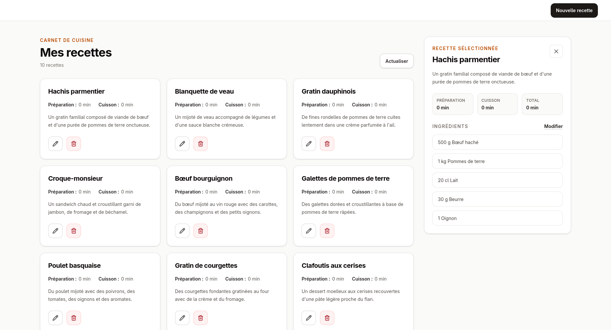

# Recipe Book — ASP.NET Core et Angular

Recipe Book est une application web full-stack pédagogique de gestion de recettes, construite avec ASP.NET Core, Entity Framework Core, SQLite et Angular. Elle permet de consulter, de créer, de modifier et de supprimer des recettes comprenant un nom, une description, un temps de préparation et un temps de cuisson.



## Objectifs d'apprentissage

Ce projet sert de support pour pratiquer les bases d'une application web full-stack :

- structurer une API ASP.NET Core avec des controllers ;
- manipuler Entity Framework Core, les migrations et une base SQLite locale ;
- modéliser une relation entre recettes et ingrédients ;
- exposer des endpoints REST pour lire, créer, modifier et supprimer des données ;
- valider les données envoyées à l'API avec des attributs de validation ;
- créer une interface Angular avec des routes, des services HTTP et des formulaires réactifs ;
- gérer des formulaires Angular réactifs avec des champs dynamiques pour les ingrédients ;
- composer l’interface avec un composant réutilisable pour les ingrédients ;
- utiliser des types partagés côté frontend et des modèles de requête validés côté API ;
- connecter le frontend et le backend avec un proxy `/api` en développement.

## Fonctionnalités

- affichage de la liste des recettes ;
- affichage du détail d'une recette avec sa liste d'ingrédients ;
- création d'une recette avec nom, description, temps de préparation et temps de cuisson ;
- création et modification d'une recette avec des ingrédients dynamiques ;
- modification d'une recette existante ;
- suppression d'une recette depuis la liste ;
- validation des champs côté interface et côté API ;
- initialisation automatique de recettes de démonstration enrichies d'ingrédients si la base est vide ;
- stockage local des données dans une base SQLite.

## Installation

### Prérequis

- SDK .NET 10 ;
- Node.js et npm.

### Backend

Les dépendances .NET sont restaurées automatiquement au premier démarrage de l'API.

### Frontend

Installer les dépendances du frontend :

```bash
cd frontend
npm install
```

## Démarrage

1. Lancer l'API ASP.NET Core :

   ```bash
   cd api
   dotnet run
   ```

   L'API sera disponible sur `http://localhost:5174/`.

   Au démarrage, l'application applique automatiquement les migrations Entity Framework Core
   et initialise des recettes de démonstration si la base est vide.

2. Dans un autre terminal, lancer l'application Angular :

   ```bash
   cd frontend
   npm start
   ```

L'application sera disponible sur `http://localhost:4200/`.
